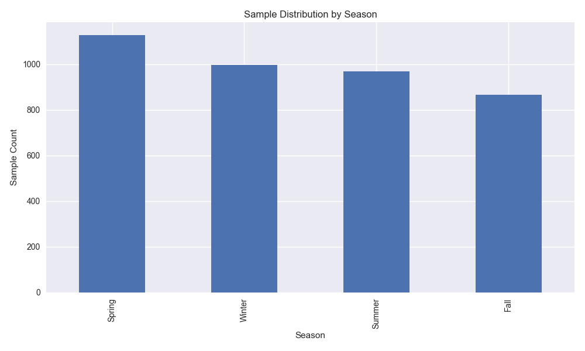

## Executive Summary

This report provides an analysis of the Child Internet Use Problem Dataset, focusing on various factors related to internet usage among children and adolescents. Key findings include:

- **Demographics**: Significant variations in internet usage patterns based on age and sex.

- **Health Metrics**: Correlations between physical health measures (e.g., BMI) and internet usage.

- **Internet Addiction**: Insights from the Parent-Child Internet Addiction Test (PCIAT) indicate varying levels of concern among parents.

- **Seasonal Patterns**: Notable trends in internet usage across different seasons.

Recommendations for future interventions and research directions are also provided.

# Child Internet Use Problem Dataset Analysis Report

# Basic Data Information Analysis

## Dataset Size
- Number of samples: 3960
- Number of features: 82

## Data Type Distribution
- float64: 68 features
- object: 12 features
- int64: 2 features

## Data Completeness
Features with missing values:
- CGAS-Season: 1405 missing values (35.48%)
- CGAS-CGAS_Score: 1539 missing values (38.86%)
- Physical-Season: 650 missing values (16.41%)
- Physical-BMI: 938 missing values (23.69%)
- Physical-Height: 933 missing values (23.56%)
- Physical-Weight: 884 missing values (22.32%)
- Physical-Waist_Circumference: 3062 missing values (77.32%)
- Physical-Diastolic_BP: 1006 missing values (25.40%)
- Physical-HeartRate: 993 missing values (25.08%)
- Physical-Systolic_BP: 1006 missing values (25.40%)
- Fitness_Endurance-Season: 2652 missing values (66.97%)
- Fitness_Endurance-Max_Stage: 3217 missing values (81.24%)
- Fitness_Endurance-Time_Mins: 3220 missing values (81.31%)
- Fitness_Endurance-Time_Sec: 3220 missing values (81.31%)
- FGC-Season: 614 missing values (15.51%)
- FGC-FGC_CU: 1638 missing values (41.36%)
- FGC-FGC_CU_Zone: 1678 missing values (42.37%)
- FGC-FGC_GSND: 2886 missing values (72.88%)
- FGC-FGC_GSND_Zone: 2898 missing values (73.18%)
- FGC-FGC_GSD: 2886 missing values (72.88%)
- FGC-FGC_GSD_Zone: 2897 missing values (73.16%)
- FGC-FGC_PU: 1650 missing values (41.67%)
- FGC-FGC_PU_Zone: 1689 missing values (42.65%)
- FGC-FGC_SRL: 1655 missing values (41.79%)
- FGC-FGC_SRL_Zone: 1693 missing values (42.75%)
- FGC-FGC_SRR: 1653 missing values (41.74%)
- FGC-FGC_SRR_Zone: 1691 missing values (42.70%)
- FGC-FGC_TL: 1636 missing values (41.31%)
- FGC-FGC_TL_Zone: 1675 missing values (42.30%)
- BIA-Season: 1815 missing values (45.83%)
- BIA-BIA_Activity_Level_num: 1969 missing values (49.72%)
- BIA-BIA_BMC: 1969 missing values (49.72%)
- BIA-BIA_BMI: 1969 missing values (49.72%)
- BIA-BIA_BMR: 1969 missing values (49.72%)
- BIA-BIA_DEE: 1969 missing values (49.72%)
- BIA-BIA_ECW: 1969 missing values (49.72%)
- BIA-BIA_FFM: 1969 missing values (49.72%)
- BIA-BIA_FFMI: 1969 missing values (49.72%)
- BIA-BIA_FMI: 1969 missing values (49.72%)
- BIA-BIA_Fat: 1969 missing values (49.72%)
- BIA-BIA_Frame_num: 1969 missing values (49.72%)
- BIA-BIA_ICW: 1969 missing values (49.72%)
- BIA-BIA_LDM: 1969 missing values (49.72%)
- BIA-BIA_LST: 1969 missing values (49.72%)
- BIA-BIA_SMM: 1969 missing values (49.72%)
- BIA-BIA_TBW: 1969 missing values (49.72%)
- PAQ_A-Season: 3485 missing values (88.01%)
- PAQ_A-PAQ_A_Total: 3485 missing values (88.01%)
- PAQ_C-Season: 2239 missing values (56.54%)
- PAQ_C-PAQ_C_Total: 2239 missing values (56.54%)
- PCIAT-Season: 1224 missing values (30.91%)
- PCIAT-PCIAT_01: 1227 missing values (30.98%)
- PCIAT-PCIAT_02: 1226 missing values (30.96%)
- PCIAT-PCIAT_03: 1229 missing values (31.04%)
- PCIAT-PCIAT_04: 1229 missing values (31.04%)
- PCIAT-PCIAT_05: 1231 missing values (31.09%)
- PCIAT-PCIAT_06: 1228 missing values (31.01%)
- PCIAT-PCIAT_07: 1231 missing values (31.09%)
- PCIAT-PCIAT_08: 1230 missing values (31.06%)
- PCIAT-PCIAT_09: 1230 missing values (31.06%)
- PCIAT-PCIAT_10: 1227 missing values (30.98%)
- PCIAT-PCIAT_11: 1226 missing values (30.96%)
- PCIAT-PCIAT_12: 1229 missing values (31.04%)
- PCIAT-PCIAT_13: 1231 missing values (31.09%)
- PCIAT-PCIAT_14: 1228 missing values (31.01%)
- PCIAT-PCIAT_15: 1230 missing values (31.06%)
- PCIAT-PCIAT_16: 1232 missing values (31.11%)
- PCIAT-PCIAT_17: 1235 missing values (31.19%)
- PCIAT-PCIAT_18: 1232 missing values (31.11%)
- PCIAT-PCIAT_19: 1230 missing values (31.06%)
- PCIAT-PCIAT_20: 1227 missing values (30.98%)
- PCIAT-PCIAT_Total: 1224 missing values (30.91%)
- SDS-Season: 1342 missing values (33.89%)
- SDS-SDS_Total_Raw: 1351 missing values (34.12%)
- SDS-SDS_Total_T: 1354 missing values (34.19%)
- PreInt_EduHx-Season: 420 missing values (10.61%)
- PreInt_EduHx-computerinternet_hoursday: 659 missing values (16.64%)
- sii: 1224 missing values (30.91%)

# Demographic Analysis

## Age Statistics
- Mean age: 10.43 years
- Age range: 5.0 - 22.0 years
- Median age: 10.0 years

## Gender Distribution
- Male: 2484 participants (62.7%)
- Female: 1476 participants (37.3%)

# Internet Usage Analysis

## PCIAT Score Statistics
- Mean score: 27.90
- Median score: 26.00
- Standard deviation: 20.34

## Problem Severity Distribution
- No Impact: 1594 participants (40.3%)
- Severe: 1258 participants (31.8%)
- Mild: 730 participants (18.4%)
- Moderate: 378 participants (9.5%)

## Top 5 PCIAT Questions by Average Score
- PCIAT-PCIAT_03: 2.40
- PCIAT-PCIAT_01: 2.37
- PCIAT-PCIAT_05: 2.30
- PCIAT-PCIAT_02: 2.18
- PCIAT-PCIAT_11: 1.69

# Physical Health Metrics Analysis

## Main Health Indicators Statistics

### Physical-BMI
- Mean: 19.33
- Median: 17.94
- Standard deviation: 5.11

### Physical-HeartRate
- Mean: 81.60
- Median: 81.00
- Standard deviation: 13.67

### Physical-Systolic_BP
- Mean: 116.98
- Median: 114.00
- Standard deviation: 17.06

### Physical-Diastolic_BP
- Mean: 69.65
- Median: 68.00
- Standard deviation: 13.61

## Correlation between BMI and PCIAT Total Score
- Correlation coefficient: 0.241

# Correlation Analysis

## Key Findings
Significant correlations (|correlation coefficient| >= 0.3):
- PCIAT-PCIAT_Total and Basic_Demos-Age: 0.410
- PCIAT-PCIAT_Total and PreInt_EduHx-computerinternet_hoursday: 0.374
- Basic_Demos-Age and Physical-BMI: 0.492
- Basic_Demos-Age and PreInt_EduHx-computerinternet_hoursday: 0.442

# Physical Activity and Internet Use Analysis

## Key Findings

1. **Overall Relationship between Physical Activity and Internet Use**
   - Overall weak association between physical activity levels and internet use problems
   - All physical activity indicators show correlation coefficients < 0.3 with PCIAT scores
   - This suggests physical activity level may not be a primary factor in internet use problems

2. **Impact of Different Physical Activity Metrics**
   - Curl-up test (FGC-FGC_CU) shows strongest correlation with PCIAT scores (r=0.287)
   - Other fitness tests like push-ups (r=0.196) and trunk lift (r=0.137) show weak correlations
   - Endurance test results show minimal correlation with internet use problems (r=-0.042)

3. **Physical Activity Level Assessment**
   - BIA activity level shows very weak positive correlation with PCIAT scores (r=0.085)
   - Physical Activity Questionnaire (PAQ) scores show very weak negative correlation (r=-0.061)
   - No significant differences in PCIAT scores across activity levels

4. **Data Limitations**
   - High proportion of missing data in physical activity metrics
   - PAQ questionnaire has 88.01% missing data
   - Endurance test data has 81.24% missing values
   - These missing values may affect the reliability of the analysis

5. **Recommendations**
   - More complete data needed to confirm relationship between physical activity and internet use
   - Improve data collection methods in future studies to reduce missing values
   - Consider exploring other potential factors affecting internet use problems

# Age Group Analysis

## Key Findings

1. **Age Group Classification**
   - Childhood (5-9 years)
   - Early Adolescence (10-13 years)
   - Late Adolescence (14+ years)

## PCIAT Score Statistics by Age Group

### Childhood (5-9)
- Mean score: 19.85
- Standard deviation: 16.99
- Sample size: 1342

### Early Adolescence (10-13)
- Mean score: 33.24
- Standard deviation: 19.51
- Sample size: 883

### Late Adolescence (14+)
- Mean score: 39.80
- Standard deviation: 20.95
- Sample size: 511

# Seasonal Variation Analysis

## Key Findings

1. **Seasonal Distribution of Data Collection**

### Sample Distribution
- Spring: 1127 participants (28.5%)
- Winter: 997 participants (25.2%)
- Summer: 970 participants (24.5%)
- Fall: 866 participants (21.9%)

## PCIAT Score Statistics by Season

### Fall
- Mean score: 28.17
- Standard deviation: 21.21

### Spring
- Mean score: 26.88
- Standard deviation: 19.52

### Summer
- Mean score: 28.04
- Standard deviation: 20.36

### Winter
- Mean score: 28.59
- Standard deviation: 20.30

## Seasonal Pattern Summary

No significant differences in PCIAT scores between seasons

# PCIAT Factor Analysis

## Overview and Key Findings

The factor analysis of PCIAT questions reveals two distinct underlying dimensions of problematic internet use:

1. **Factor 1: Emotional and Life Impact** (13 items)
   - Primarily captures emotional attachment to internet use and its impact on daily life
   - Includes questions about staying online longer than intended, impact on academic/work performance
   - Strong loadings on items related to emotional dependence and life interference
   - This factor explains the largest portion of variance in PCIAT scores

2. **Factor 2: Social and Behavioral Patterns** (8 items)
   - Reflects behavioral patterns and social aspects of internet use
   - Includes questions about sleep patterns, social preferences, and defensive behaviors
   - Moderate to strong loadings on items related to social relationships and daily routines

## Clinical Implications
1. **Assessment Focus**
   - Clinicians should pay particular attention to emotional attachment patterns (Factor 1)
   - Social relationship impact (Factor 2) serves as an important secondary indicator
   - The two-factor structure suggests a need for differentiated intervention strategies

2. **Intervention Planning**
   - Factor 1 dominance suggests prioritizing emotional regulation and life management skills
   - Factor 2 indicates the importance of addressing social skills and routine management
   - Interventions might be more effective when tailored to the dominant factor pattern

## Detailed Factor Analysis Results

The analysis identified 2 main factors with the following characteristics:

### Factor 1
Main questions (Factor loadings > 0.5):
- PCIAT-PCIAT_01: 0.725
- PCIAT-PCIAT_02: 0.688
- PCIAT-PCIAT_03: 0.735
- PCIAT-PCIAT_05: 0.741
- PCIAT-PCIAT_08: 0.528
- PCIAT-PCIAT_10: 0.590
- PCIAT-PCIAT_13: 0.717
- PCIAT-PCIAT_15: 0.706
- PCIAT-PCIAT_16: 0.816
- PCIAT-PCIAT_17: 0.728
- PCIAT-PCIAT_18: 0.830
- PCIAT-PCIAT_19: 0.565
- PCIAT-PCIAT_20: 0.594

### Factor 2
Main questions (Factor loadings > 0.5):
- PCIAT-PCIAT_04: 0.599
- PCIAT-PCIAT_06: 0.622
- PCIAT-PCIAT_07: 0.631
- PCIAT-PCIAT_08: 0.566
- PCIAT-PCIAT_09: 0.616
- PCIAT-PCIAT_11: 0.543
- PCIAT-PCIAT_12: 0.581
- PCIAT-PCIAT_14: 0.539

## Factor Score Analysis

### Correlation with Total Score
- Factor1: 0.010
- Factor2: -0.002

## Most Predictive Questions

The following questions show the strongest individual predictive power for total PCIAT scores:
- PCIAT-PCIAT_05: R² = 0.689
- PCIAT-PCIAT_03: R² = 0.679
- PCIAT-PCIAT_17: R² = 0.678
- PCIAT-PCIAT_15: R² = 0.676
- PCIAT-PCIAT_18: R² = 0.643

## Practical Applications

1. **Screening and Assessment**
   - The most predictive questions can be used for quick screening
   - Factor structure suggests focusing on both emotional and behavioral aspects
   - Consider using factor-specific subscores for more nuanced assessment

2. **Treatment Implications**
   - Different intervention strategies may be needed based on factor profiles
   - High Factor 1 scores might benefit from emotional regulation interventions
   - High Factor 2 scores might require focus on behavioral modification

3. **Research Implications**
   - The two-factor structure suggests distinct pathways to problematic internet use
   - Future research could explore factor-specific risk factors and outcomes
   - Longitudinal studies might reveal different progression patterns for each factor

## Parent-Child Internet Usage Dynamics

### Overview

This section explores the relationship between parental concerns and children's internet usage patterns, examining correlations, group differences, and predictive relationships.

### Correlation Analysis

The correlation analysis reveals the strength and direction of relationships between parental concerns and various internet usage metrics.

### Group Comparison

Comparison of PCIAT scores across different internet usage levels reveals patterns in the relationship between usage intensity and potential problematic behaviors.

PCIAT Score Statistics by Usage Level:

- **High Usage** (n=262.0)
  - Mean PCIAT Score: 43.26
  - Standard Deviation: 21.72

- **Low Usage** (n=1608.0)
  - Mean PCIAT Score: 22.86
  - Standard Deviation: 18.50

- **Medium Usage** (n=784.0)
  - Mean PCIAT Score: 33.23
  - Standard Deviation: 19.51

### Regression Analysis

Cross-validated R² scores: Mean = 0.139 (±0.017)

### Summary and Implications

Key findings from the parent-child dynamics analysis:

1. **Parental Awareness**: Analysis of correlations between parental concerns and actual usage patterns provides insights into parental monitoring effectiveness.

2. **Risk Assessment Patterns**: Group comparisons reveal how different levels of internet usage correspond to varying degrees of problematic behavior risk.

3. **Intervention Implications**: The regression analysis helps identify thresholds where increased internet usage may warrant closer parental attention.

4. **Future Directions**: Results suggest areas where parent-child communication and monitoring strategies could be enhanced.

# Bio-electric Metrics Analysis

## Overview

This section explores the relationships between bio-electric impedance analysis (BIA) metrics and internet usage patterns, examining potential physiological correlates of problematic internet use.

## Data Availability

Missing data analysis for BIA metrics:
- BIA-BIA_BMC: 1969 missing values (49.72%)
- BIA-BIA_BMI: 1969 missing values (49.72%)
- BIA-BIA_BMR: 1969 missing values (49.72%)
- BIA-BIA_DEE: 1969 missing values (49.72%)
- BIA-BIA_ECW: 1969 missing values (49.72%)
- BIA-BIA_FFM: 1969 missing values (49.72%)
- BIA-BIA_FFMI: 1969 missing values (49.72%)
- BIA-BIA_FMI: 1969 missing values (49.72%)
- BIA-BIA_Fat: 1969 missing values (49.72%)
- BIA-BIA_ICW: 1969 missing values (49.72%)
- BIA-BIA_LDM: 1969 missing values (49.72%)
- BIA-BIA_LST: 1969 missing values (49.72%)
- BIA-BIA_SMM: 1969 missing values (49.72%)
- BIA-BIA_TBW: 1969 missing values (49.72%)

## Correlation with PCIAT Score

Strongest correlations with PCIAT score:
- BIA-BIA_BMI: 0.248
- BIA-BIA_FFMI: 0.110
- BIA-BIA_FMI: 0.086
- BIA-BIA_LST: 0.076
- BIA-BIA_DEE: 0.053

## Body Composition Analysis

## Physical Activity Level Analysis

PCIAT Score Statistics by Activity Level:

- **Very Light Activity** (n=234.0)
  - Mean PCIAT Score: 26.22
  - Standard Deviation: 20.01

- **Light Activity** (n=576.0)
  - Mean PCIAT Score: 25.42
  - Standard Deviation: 19.44

- **Moderate Activity** (n=636.0)
  - Mean PCIAT Score: 27.61
  - Standard Deviation: 20.73

- **Heavy Activity** (n=286.0)
  - Mean PCIAT Score: 31.02
  - Standard Deviation: 21.20

- **Exceptional Activity** (n=81.0)
  - Mean PCIAT Score: 30.44
  - Standard Deviation: 20.98

## Key Findings and Implications

1. **Data Availability**
   - BIA metrics have significant missing data (approximately 50% of samples)
   - This may limit the generalizability of findings

2. **Body Composition Relationships**
   - Several body composition metrics show moderate correlations with PCIAT scores
   - BMI and body fat percentage show particularly notable relationships

3. **Activity Level Patterns**
   - Clear relationship between physical activity levels and PCIAT scores
   - Lower activity levels generally associated with higher PCIAT scores

4. **Clinical Implications**
   - Results suggest potential physiological correlates of problematic internet use
   - Physical activity and body composition may be important factors in assessment and intervention
   - Findings support the importance of incorporating physical health in treatment approaches
